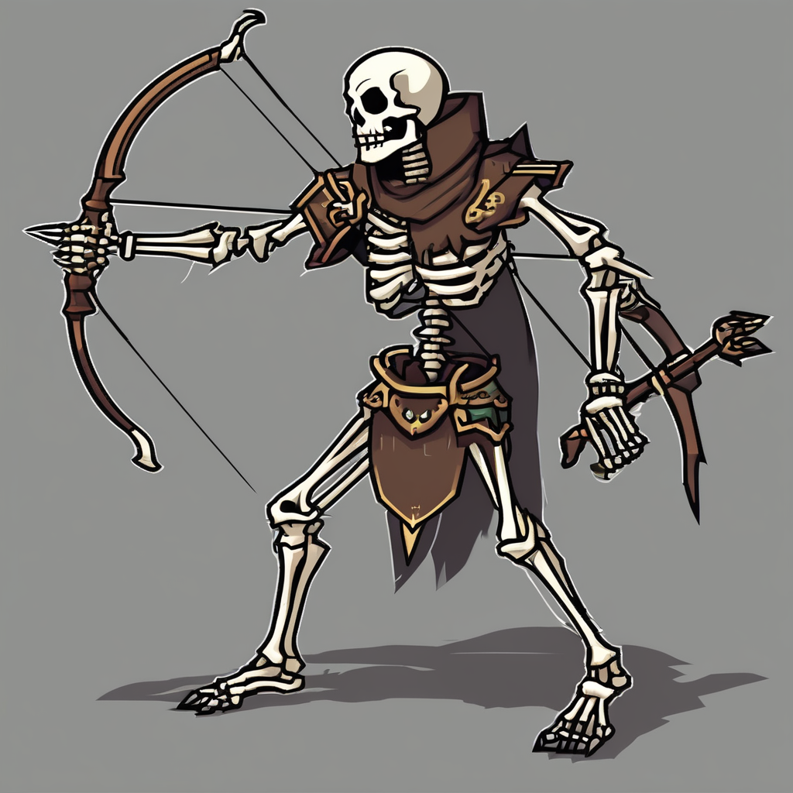
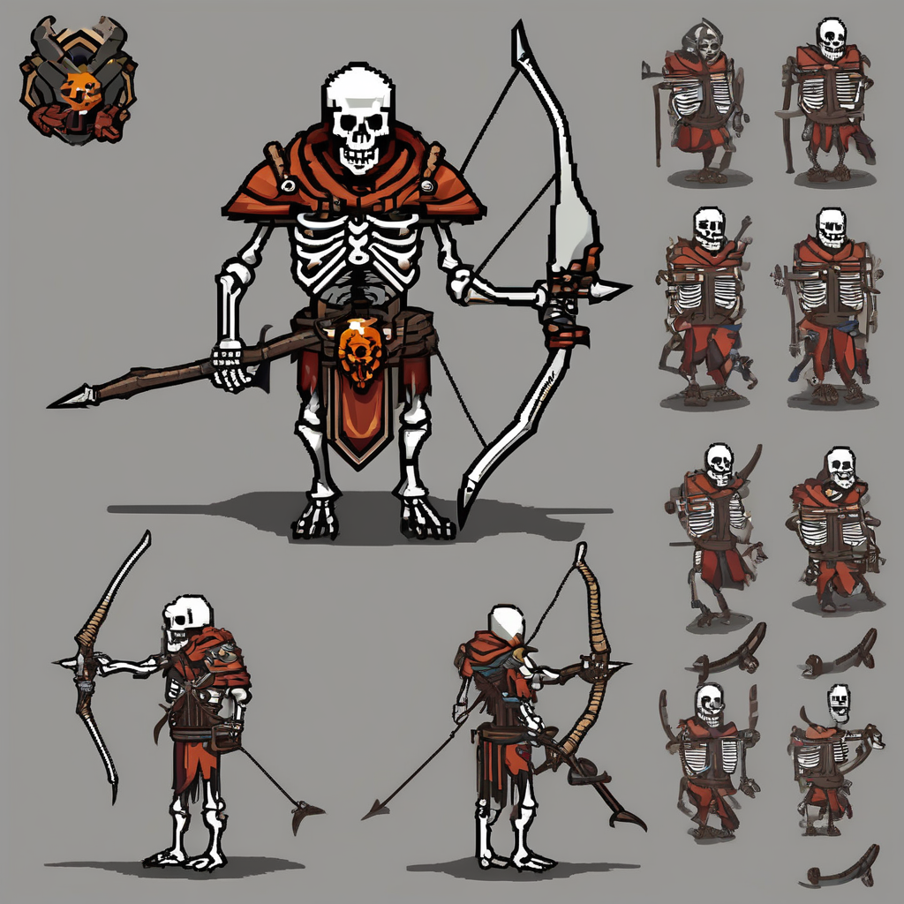
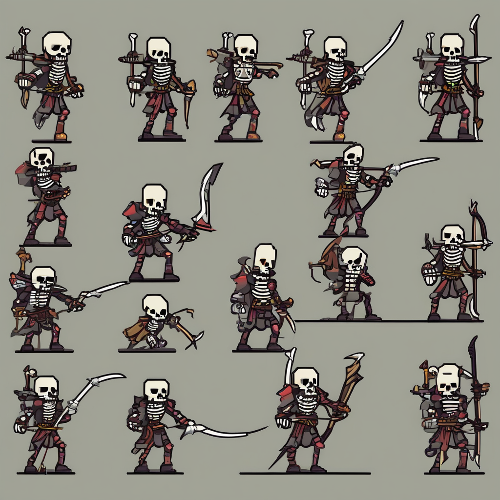
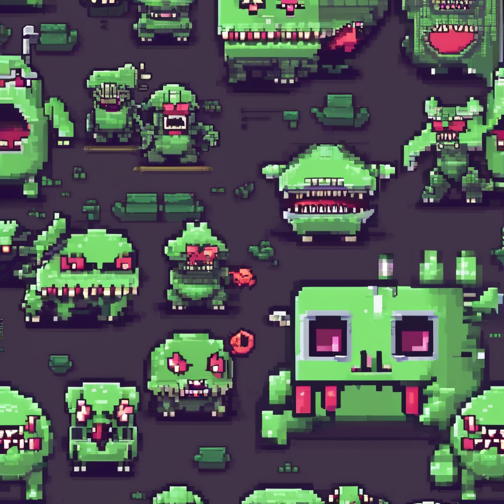
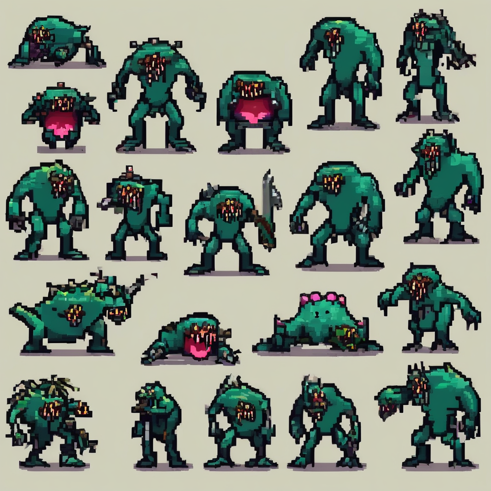
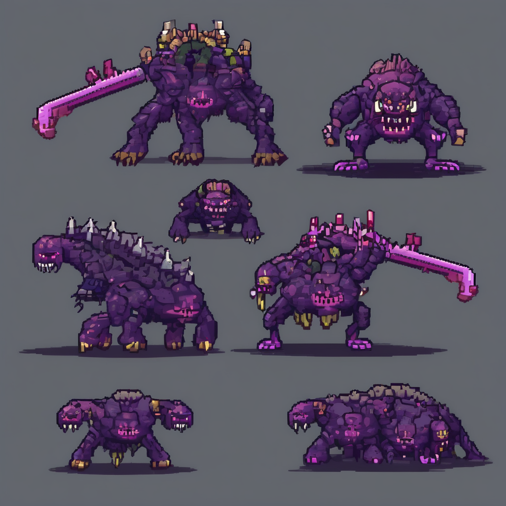
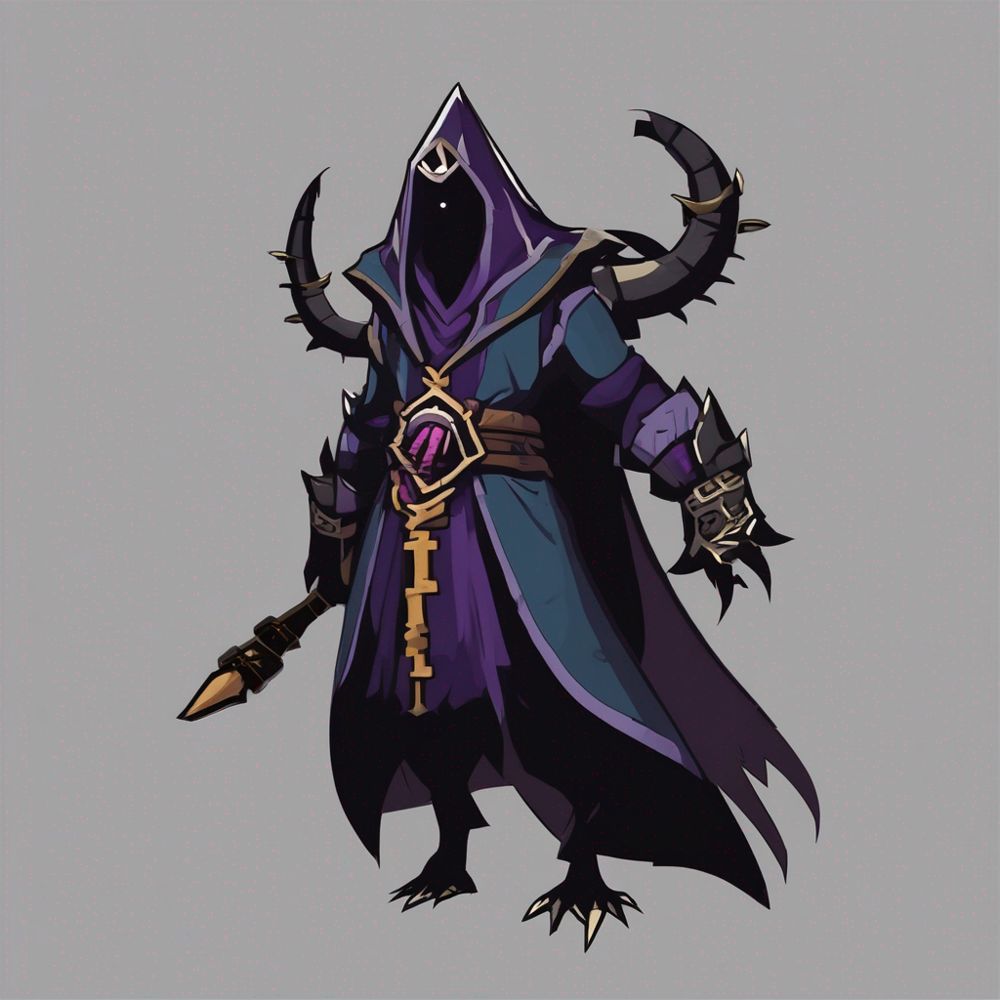
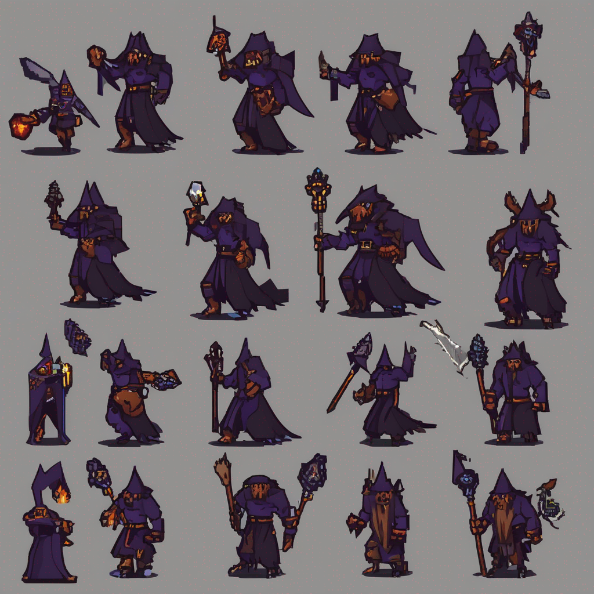
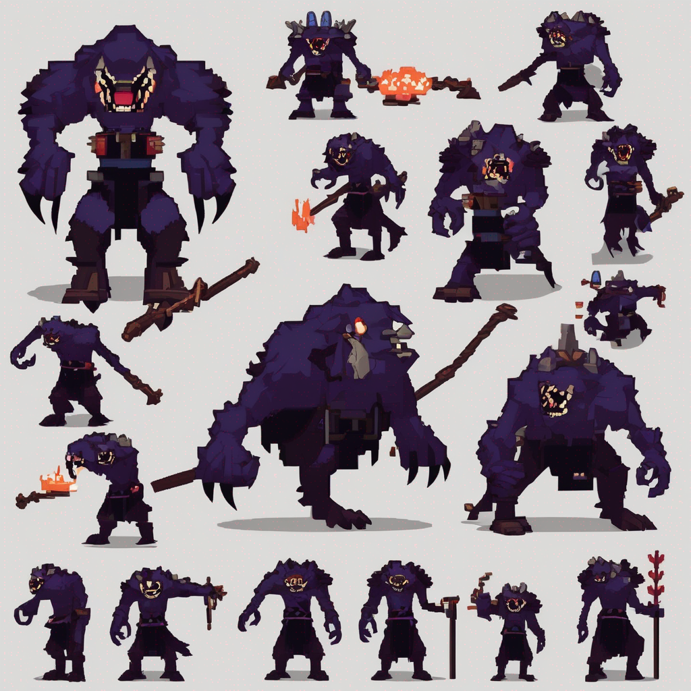

# PixelCrafter — AI Pixel Asset Pipeline

> Turn enemy names into game-ready sprite sheets. One input. Three frames. Ready for Unity.

[](https://github.com/mark2574789362-byte/pixel-crafter/actions)
[](https://opensource.org/licenses/MIT)

---

## 🎮 What It Does

PixelCrafter generates **consistent pixel art sprite sheets** for Roguelike games — from a single enemy name to a production-ready asset in seconds.

```
Skeleton Warrior → [idle] [attack] [death] → spritesheet.png + metadata.json
```

---

## 🎨 Generated Assets

### Case 1 — Skeleton Archer (Pixel Fantasy style)

**Palette**: `#4a90d9 #2d5a87 #f4d03f #e74c3c #27ae60 #9b59b6`

| idle | attack | death |
|------|--------|-------|
|  |  |  |

---

### Case 2 — Poison Slime (Neon Cyberpunk style)

**Palette**: `#0ff #ff00ff #00ff00 #ff6600 #0000ff #ffff00`

| idle | attack | death |
|------|--------|-------|
|  |  |  |

---

### Case 3 — Dark Mage (Dark Dungeon style)

**Palette**: `#1a1a2e #16213e #0f3460 #e94560 #533483 #94a3b8`

| idle | attack | death |
|------|--------|-------|
|  |  |  |

---

## 🔥 Features

### Style Palette Lock ✅
Each style has a **locked 6-color palette**. Assets are constrained to the palette — visual consistency across all characters in your game.

### Multi-Frame Generation ✅
One enemy name → three animation frames:
- **Idle** — breathing, alert stance
- **Attack** — strike/cast pose
- **Death** — defeat animation

### Sprite Sheet Export ✅
Automatic horizontal Sprite Sheet assembly. Download as PNG + JSON metadata for Unity/Godot import.

### Style Presets
- 🎨 **Pixel Fantasy** — Vibrant 16-bit JRPG
- 🏴 **Dark Dungeon** — Moody torchlit dungeon
- 🌃 **Neon Cyberpunk** — Glowing retrowave city
- 🎌 **Anime RPG** — Pastel JRPG aesthetic
- 👾 **Retro 8-bit** — Authentic NES palette

---

## 📐 Architecture

```
User Input: "Skeleton Warrior"
    ↓
Prompt Engineering Pipeline
  - Style Palette Lock (6-color constraint)
  - Asset Type Context (enemy template)
  - Frame Action Template (idle/attack/death)
    ↓
Cloudflare Worker (API Proxy)
  - Bypasses CORS
  - Manages Replicate API
  - Handles async prediction polling
    ↓
Stability AI SDXL (via Replicate)
    ↓
Sprite Sheet Assembly (Canvas API)
    ↓
PNG + JSON Export
```

---

## 📁 Project Structure

```
pixel-crafter/
├── src/
│   ├── App.tsx              # Main app UI
│   ├── components/ui/      # Shadcn/ui components
│   ├── lib/
│   │   ├── promptBuilder.ts # Prompt engineering + style palettes
│   │   └── spriteSheetExporter.ts
│   ├── worker/
│   │   └── index.ts         # Cloudflare Worker proxy
│   └── types/
│       └── index.ts
├── generated-assets/        # Sample outputs (README only)
├── wrangler.toml
└── .github/workflows/
    └── worker.yml
```

---

## 🚀 Getting Started

```bash
git clone https://github.com/mark2574789362-byte/pixel-crafter
cd pixel-crafter
npm install
npm run dev
```

### Environment Setup

1. Get Replicate API token: [replicate.com/account/api-tokens](https://replicate.com/account/api-tokens)
2. Add `REPLICATE_API_TOKEN` to GitHub repo secrets
3. Push to `main` — auto-deploys via GitHub Actions

### Deployment

Push to `main` → GitHub Actions auto-deploys:
- Frontend → Cloudflare Pages
- Worker → Cloudflare Workers

---

## 📊 Current Status

| Feature | Status |
|---------|--------|
| Style Palette Lock | ✅ Implemented |
| Multi-Frame Generation | ✅ Implemented |
| Sprite Sheet Export | ✅ Implemented |
| Cloudflare Worker Proxy | ✅ Deployed |
| Generated Assets Demo | ✅ 3 cases documented |

---

## ⚠️ Current Limitations

- Animation consistency may be unstable across different poses
- Complex or multi-character compositions may fail
- .shop TLD not supported by Cloudflare Pages (use pages.dev subdomain)

---

## 📝 License

MIT